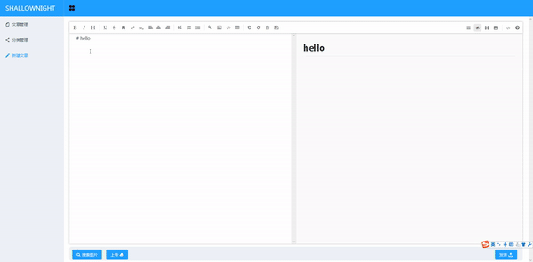
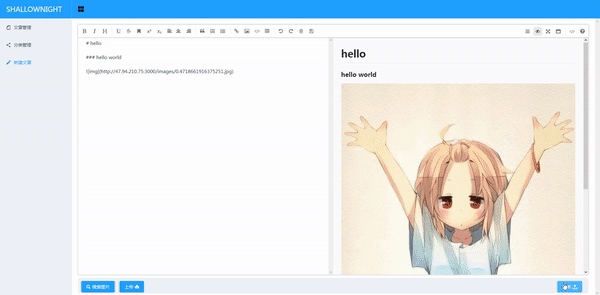
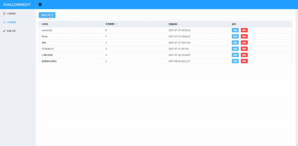
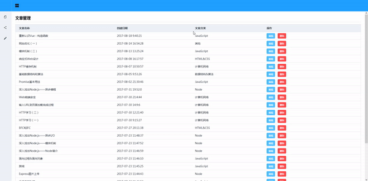

# Shllownight.com个人博客后台
> www.shallownight.com网站的后端管理。  
> 真正上线的时候要把myweb打包给myserver。

## 后台管理界面
项目分为两个部分：myserver和myweb。  

mysever是后端，使用用express框架，myweb是前端，用的vue框架。  

### 文章编辑

### 文章上传

### 分类管理

### 文章管理

项目使用Vue框架，可独立运行，但建议打包到Express框架中。

## 后台程序
后台使用的Node的Express框架，主要内容为：

1. 接收和处理浏览器请求；
2. 连接数据库，操作数据库；
3. 作为服务器运行后台管理页面。